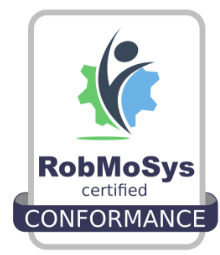

GitHub (Linux): 

Travis (Linux): 

AppVeyor (Windows): 

Question? 

# About BehaviorTree.CPP

This  __C++__ library provides a framework to create BehaviorTrees.
It was designed to be flexible, easy to use, reactive and fast.

Even if our main use-case is __robotics__, you can use this library to build
__AI for games__, or to replace Finite State Machines in you application.

There are few features that make __BehaviorTree.CPP__ unique, when compared to other implementations:

- It makes __asynchronous Actions__, i.e. non-blocking, a first-class citizen.

- You can build __reactive__ behaviors that execute multiple Actions concurrently.

- Even if it is written in __C++__, Trees are defined using a Domain Specific Scripting 
  __scripting language__ (based on XML), and can be loaded at run-time; in other words, 
  even if it written in C++, Trees are _not_ hard-coded.

- You can link staticaly you custom TreeNodes or convert them into __plugins __
which can be loaded at run-time.

- It provides a type-safe and flexible mechanism to do __Dataflow__ between
  Nodes of the Tree.

- It includes a __logging/profiling__ infrastructure that allows the user 
to visualize, record, replay and analyze state transitions.

- Last but not least: it is well [documented](https://www.behaviortree.dev/)!

# Documentation

You can learn about the main concepts, the API and the tutorials here: https://www.behaviortree.dev/

To find more details about the conceptual ideas that make this implementation different from others, you can read the [final deliverable of the project MOOD2Be](https://github.com/BehaviorTree/BehaviorTree.CPP/blob/master/MOOD2Be_final_report.pdf).

# About version 3.X

The main goal of this project is to create a Behavior Tree implementation
that uses the principles of Model Driven Development to separate the role 
of the __Component Developer__ from the __Behavior Designer__.

In practice, this means that:

- Custom TreeNodes must be reusable building blocks. 
 You should be able to implement them once and reuse them to build many behaviors.

- To build a Behavior Tree out of TreeNodes, the Behavior Designer must 
not need to read nor modify the source code of the a given TreeNode.

Version __3.x__ of this library introduces some dramatic changes in the API, but 
it was necessary to reach this goal.

If you used version 2.X in the past, you can 
[find here the Migration Guide](https://behaviortree.github.io/BehaviorTree.CPP/MigrationGuide).

# GUI Editor

Editing a BehaviorTree is as simple as editing a XML file in your favourite text editor.

If you are looking for a more fancy graphical user interface (and I know your do) check 
[Groot](https://github.com/BehaviorTree/Groot) out.

## Watch Groot and BehaviorTree.CPP in action

Click on the following image to see a short video of how the C++ library and
the graphic user interface are used to design and monitor a Behavior Tree.

# How to compile

On Ubuntu, you must install the following dependencies:

     sudo apt-get install libzmq3-dev libdw-dev
     
Any other dependency is already included in the __3rdparty__ folder.

## Catkin and ROS users

You can easily install the package with the command

      sudo apt-get install ros-$ROS_DISTRO-behaviortree-cpp
      
If you want to compile it with catkin, you __must__ include this package 
to your catkin workspace.

# Acknowledgement

This library was developed at  **Eurecat - https://eurecat.org/en/** (main author, Davide Faconti) in a joint effort
with the **Italian Institute of Technology** (Michele Colledanchise).

This software is one of the main components of [MOOD2Be](https://eurecat.org/en/portfolio-items/mood2be/),
which is one of the six **Integrated Technical Projects (ITPs)** selected from the
[RobMoSys first open call](https://robmosys.eu/itp/). Therefore, MOOD2Be has been supported by the European Horizon2020 project RobMoSys. This software is RobMoSys conformant. 

# Further readings

- Introductory article: [Behavior trees for AI: How they work](http://www.gamasutra.com/blogs/ChrisSimpson/20140717/221339/Behavior_trees_for_AI_How_they_work.php)

- **How Behavior Trees Modularize Hybrid Control Systems and Generalize 
Sequential Behavior Compositions, the Subsumption Architecture,
and Decision Trees.** 
Michele Colledanchise and Petter Ogren. IEEE Transaction on Robotics 2017.

- **Behavior Trees in Robotics and AI**, 
published by CRC Press Taylor & Francis, available for purchase
(ebook and hardcover) on the CRC Press Store or Amazon.

The Preprint version (free) is available here: https://arxiv.org/abs/1709.00084

# License

The MIT License (MIT)

Copyright (c) 2014-2018 Michele Colledanchise
Copyright (c) 2018-2019 Davide Faconti

Permission is hereby granted, free of charge, to any person obtaining a copy
of this software and associated documentation files (the "Software"), to deal
in the Software without restriction, including without limitation the rights
to use, copy, modify, merge, publish, distribute, sublicense, and/or sell
copies of the Software, and to permit persons to whom the Software is
furnished to do so, subject to the following conditions:

The above copyright notice and this permission notice shall be included in all
copies or substantial portions of the Software.

THE SOFTWARE IS PROVIDED "AS IS", WITHOUT WARRANTY OF ANY KIND, EXPRESS OR
IMPLIED, INCLUDING BUT NOT LIMITED TO THE WARRANTIES OF MERCHANTABILITY,
FITNESS FOR A PARTICULAR PURPOSE AND NONINFRINGEMENT. IN NO EVENT SHALL THE
AUTHORS OR COPYRIGHT HOLDERS BE LIABLE FOR ANY CLAIM, DAMAGES OR OTHER
LIABILITY, WHETHER IN AN ACTION OF CONTRACT, TORT OR OTHERWISE, ARISING FROM,
OUT OF OR IN CONNECTION WITH THE SOFTWARE OR THE USE OR OTHER DEALINGS IN THE
SOFTWARE.
